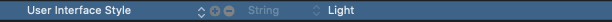

# DarkMode-Demo
Dark mode &amp; Light mode handling tutorial


### Dark mode handling

> You need only light mode


 

> You need only dark mode

 

### Steps:

>  1.Open Assets and Creat new color sets  ex: Theme

>  2.Just use the colorset to  Buttons, views  and where you need.

 

>  3.You can use your asset color programmatically

#### Swift code　

```javascript

let color = UIColor(named: "Theme")
       
button.backgroundColor = color

```
>  4.Run the code!

### ScreenShots:

 Light Mode                          |  Dark Mode
:--------------------------------:|:--------------------------------:
  |  
